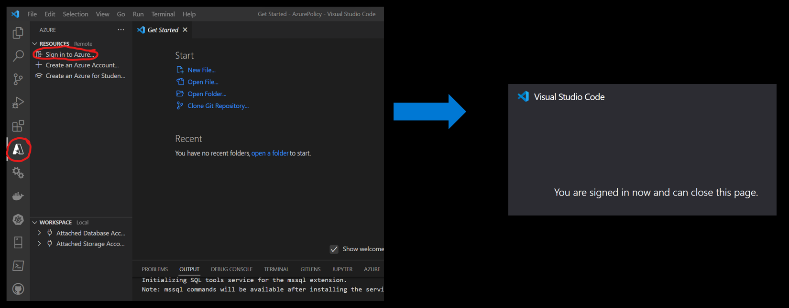

# AzurePolicyWorkshop

- [AzurePolicyWorkshop](#azurepolicyworkshop)
  - [Agenda](#agenda)
    - [Day 1](#day-1)
    - [Day 2](#day-2)
    - [Day 3](#day-3)
  - [Labs](#labs)
    - [Setup the local tools & environment](#setup-the-local-tools--environment)
    - [Deployment of Azure resources](#deployment-of-azure-resources)

## Agenda

### Day 1

- Tooling
  - We install all the tools needed for successful policy configuration & deployment

- Deployment of test resources
  - In order to test Azure Policy, we need to ensure that we have test Azure resources. We use pre-written Bicep templates in order to deploy what we need

- Scope
  - We look at two types of scope here. Deployment scope and Policy scope. 

- Effects
  - Each policy definition in Azure Policy has a single effect. That effect determines what happens when the policy rule is evaluated to match. The effects behave differently if they are for a new resource, an updated resource, or an existing resource.

- Compliance
  - Look at compliance Vs non-compliance and the Policy compliance checker.

- Remediation
  - Looking at Remediation, remediation of non-compliant resources. Resources that are non-compliant to policies with deployIfNotExists or modify effects can be put into a compliant state through Remediation.

- Managed Identities
  - We understand what are managed identities and how that are used in conjunction with the two effects, **deployIfNotExists** or **Modify**.

### Day 2

- Policy Functions
  - All [resource Manager template functions](https://docs.microsoft.com/en-us/azure/azure-resource-manager/templates/template-functions) are available to use within a policy rule, except certain functions and user-defined functions.

- Policy Definitions
  - Policy Definitions define a Policy. We look at both options for built-in Policy Definitions and Custom Policy Definitions. We understand the best practice of where custom Policy Definitions live in an Azure subscription and the structure of Policy Definitions.

- Policy Initiatives
  - A Policy Initiatives are the new name for Policy Set Definitions and is like a group of Policy Definitions.

- Policy Assignments
  - We can assign both Policy Initiatives and Policy Definitions to scope, either a scope comprising of a Management Group, subscription or resource group
 
- Deployment of Policies
  - Looking at options to deploy Azure Policies. 

### Day 3

- Regulatory Compliance in Azure Policy
  - Regulatory Compliance in Azure Policy provides built-in initiative definitions to view a list of the controls and compliance domains based on responsibility (Customer, Microsoft, Shared).

- Policy Testing
  - We look at ways to test Azure Policy without initiating the policy effect or triggering entries in the Azure Activity log.

- Guest Configuration/Azure Automanage Machine Configuration
  - Azure Policy's guest configuration feature provides native capability to audit or configure operating system settings as code, both for machines running in Azure and hybrid Arc-enabled machines. The feature can be used directly per-machine, or at-scale orchestrated by Azure Policy.
  - We run some tests on Virtual Machines running in Azure.

## Labs

### Setup the local tools & environment

1. [Install the Azure extension for VS Code](https://marketplace.visualstudio.com/items?itemName=ms-vscode.vscode-node-azure-pack). Then sign into Azure.

2. [Use Azure Policy extension for Visual Studio Code](https://docs.microsoft.com/en-us/azure/governance/policy/how-to/extension-for-vscode)

3. [Install PowerShell on Windows, Linux, and macOS](https://docs.microsoft.com/en-us/powershell/scripting/install/installing-powershell)

4. [Install the Azure Az PowerShell module](https://docs.microsoft.com/en-us/powershell/azure/install-az-ps)

5. [Install Bicep tools & Azure CLI](https://docs.microsoft.com/en-us/azure/azure-resource-manager/bicep/install)

 You must have Azure CLI version 2.20.0 or later installed.
 
 You can install the Bicep CLI and add it to your PATH. [You must manually install](https://docs.microsoft.com/en-us/azure/azure-resource-manager/bicep/install#install-manually) for any use other than Azure CLI. 
 
 Supported OS’s are Linux, MacOS, Windows

### Deployment of Azure resources

Run the `_deploy-AzureBicepResources.ps1` file in the [Deployment of Azure resources](/Deployment%20of%20Azure%20resources/) folder.